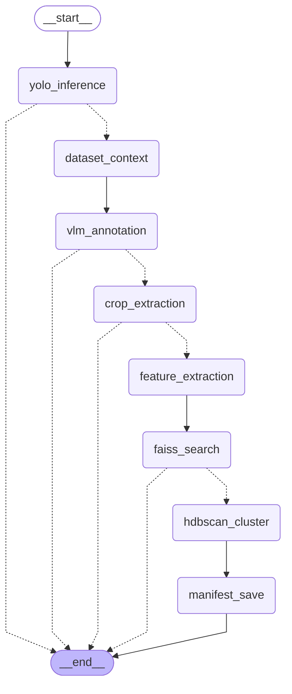

```mermaid
---
config:
  flowchart:
    curve: linear
---
graph TD;
	__start__([<p>__start__</p>]):::first
	yolo_inference(yolo_inference)
	vlm_annotation(vlm_annotation)
	crop_extraction(crop_extraction)
	feature_extraction(feature_extraction)
	faiss_search(faiss_search)
	hdbscan_cluster(hdbscan_cluster)
	dataset_context(dataset_context)
	manifest_save(manifest_save)
	__end__([<p>__end__</p>]):::last
	__start__ --> yolo_inference;
	crop_extraction -.-> __end__;
	crop_extraction -.-> feature_extraction;
	dataset_context --> vlm_annotation;
	faiss_search -.-> __end__;
	faiss_search -.-> hdbscan_cluster;
	feature_extraction --> faiss_search;
	hdbscan_cluster --> manifest_save;
	vlm_annotation -.-> __end__;
	vlm_annotation -.-> crop_extraction;
	yolo_inference -.-> __end__;
	yolo_inference -.-> dataset_context;
	manifest_save --> __end__;
	classDef default fill:#f2f0ff,line-height:1.2
	classDef first fill-opacity:0
	classDef last fill:#bfb6fc
```
